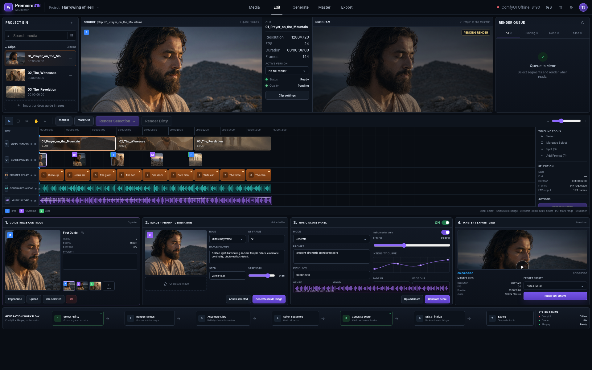

# Premiere316 · AI Director Prototype

A polished Premiere-style video-generation workspace that drives the supplied **LTX Director i2v** workflow in ComfyUI without making the user edit the Director node canvas.



## What is implemented

### Video-generation timeline

- Frame-accurate V1 shot timeline.
- Prompt Relay segments on P1 with editable motion prompts.
- Click, Ctrl/Cmd-click, and Shift-click segment selection.
- Mark In / Mark Out rendering.
- **Render Selection**, **Render Dirty**, and full-clip rendering.
- Noncontiguous selections are split into separate contiguous ComfyUI jobs.
- LTX-valid `8n + 1` generation lengths are handled automatically, then trimmed back to the exact requested frame count.
- Prompt Relay values are serialized with the required `" | "` delimiter.

### First, middle, and last guide images

- Dedicated G1 guide track.
- First-frame, middle-keyframe, and last-frame roles.
- Attach a generated and individually approved Asset Foundry image from the canonical Project Bin.
- Prompt, seed, strength, frame position, and role controls.
- Guide versions and active-guide thumbnails.
- The Edit workspace links directly back to **Asset Foundry** for canonical image creation; direct upload and prototype-generation bypasses are intentionally unavailable.

### Versions and range replacement

- Full render versions and selected-range versions are stored separately.
- A new selected-range render overrides only its exact portion of the accepted clip.
- Accepted footage before and after the replacement remains intact.
- Range pieces are normalized and assembled into a new accepted clip version.

### Score and final master

- Project-level M1 musical-score controls.
- Prompt, genre, mood, tempo, fades, level, and dialogue ducking.
- Upload an existing score or generate the included local prototype score.
- Assemble active clip versions, stitch the complete sequence, then generate/mix music afterward.
- Optional post-production bookends are appended only while building the Final Master: an exact 30-second opening slate and an exact 30-second scrolling end-credit card.
- The opening is deterministically typeset as `Premiere316 Productions` from a server-locked constant, so no image/video model can alter or misspell it. End-credit copy remains editable in the Master / Export panel.
- Bookends use FFmpeg rather than ComfyUI, consume no generation VRAM, preserve the film timeline, and carry silent 48 kHz stereo so the film score remains synchronized to the core sequence.
- Final H.264 master history and direct export link.
- Existing LTX video audio is retained and music is mixed beneath it.

### Included demo

The package includes a populated **Harrowing of Hell** project with the completed ten-minute screenplay, structured production review, 97-asset production library, guide media, a generated score, synchronized sound-direction assets, a deterministic title card, and enabled 30-second opening/credit master bookends. Use the screenplay's LTX Shot Planner when you are ready to create or refresh timeline clips.

### Screenplay studio

- A dedicated **Screenplay** workspace creates complete cinematic production packages with the local LM Studio model selected by the project owner.
- The model is pinned to `qwen3.6-40b-claude-4.6-opus-deckard-heretic-uncensored-thinking-neo-code-di-imatrix-max`; the server does not silently substitute another model.
- Generate from a concept, import an existing Markdown or text package, edit the source, and save it with the project.
- The **Chat** view streams the pinned model's visible response token by token. You can press **Stop** at any time or send a message while it is writing; Premiere316 preserves the partial draft and immediately continues under the new direction.
- Follow-up chat corrections are applied as compact exact-text screenplay patches, preserving untouched sections and avoiding an expensive full-document rewrite for every adjustment. Hidden model reasoning is never displayed or stored.
- Production packages can include the screenplay, scene and character specifications, first/last-frame image prompts, prop and environment assets, dialogue, voice direction, and sound direction.
- **Generate Shot Plan** asks the same pinned model to turn the screenplay into structured 6–30 second video shots.
- Shot-plan and other long structured requests use LM Studio's SSE transport internally, even though Premiere316 waits for the finished JSON result. This avoids Node's approximately five-minute non-streaming response-header timeout; large local plans can safely continue for the configured 20-minute generation window.
- **Build Timeline Clips** converts that plan into editable Premiere316 clips and Prompt Relay segments. The generated clips intentionally begin without guide images, so their first/middle/last guides can be reviewed or generated before video rendering.
- **Approve Screenplay for Assets** records the SHA-256 revision of the reviewed screenplay. Asset-manifest building and all individual/batch asset-generation routes are server-locked until that exact revision is approved. Any import, manual edit, generated replacement, stopped partial draft, or chat correction revokes approval automatically.
- The Screenplay inspector presents approval as **Step 1 of 2** with one prominent **Approve This Screenplay** action. Once approved, that same card becomes **Continue to Assets**, avoiding competing approval buttons elsewhere in the inspector.

The included *Jesus: The Harrowing of Hell* screenplay has been imported into `projects/harrowing_of_hell/screenplay.md` and remains editable in the Screenplay workspace.

### Pi ComfyUI Expert orchestrator

- The same **Pi ComfyUI Expert** launched by `C:\Users\Blokey\Desktop\Pi ComfyUI Expert.lnk` is embedded as a persistent dock on Projects, Screenplay, Assets, Media, Edit, Generate, Master, and Export.
- Premiere316 publishes an authoritative live context snapshot whenever the visible page, project, active workbench, selected clip/guide/range, playhead, render queue, ComfyUI state, LM Studio state, browser focus, or tab visibility changes. The snapshot is also attached to every queued worker task, so later navigation cannot rewrite the context under an already-submitted request.
- The parent is pinned to `lmstudio/qwen3.6-35b-a3b-uncensored-hauhaucs-aggressive`. Every actionable request is mechanically hard-routed through `/run premiere-worker` before the parent can answer; delegation is not left to model discretion.
- `premiere-worker` is pinned to that same model at **high** thinking, receives forked conversation/page context, owns all reads, web research, commands, edits, and validation, and has `maxSubagentDepth: 0`, so it cannot become another orchestrator.
- The host serializes requests through one worker-first queue, validates the terminal worker name, exit code, completion state, model and output, and only then starts the parent synthesis pass. During synthesis, all parent tools are disabled; the parent can review and explain the worker result but cannot secretly edit files or launch a substitute worker.
- The dock streams the parent response, displays Worker/Supervising/Ready state, exposes queued corrections and Stop, and retains one persistent Pi session. `pi-web-access` supplies the worker's internet-search and fetch tools.
- The desktop shortcut uses the same isolated profile and same globally discoverable `premiere-worker`. In standalone TUI mode, natural-language requests are intercepted by the profile's host orchestrator extension and hard-routed to the worker before the parent synthesis turn. Slash commands remain available normally.

### Asset Foundry

- **Assets** is a dedicated workspace immediately after Screenplay, with category navigation, production coverage, review decisions, asset cards, a provenance inspector, continuity locks, dependencies, version history, and serialized generation controls.
- The completed Harrowing screenplay currently resolves to **97 project assets**: characters, wardrobes, locations, props, crowds/creatures, atmosphere/VFX states, guide frames, voices, sound directions, music cues, and graphics.
- Visual assets are routed through the installed **CI FLUX.2 Premiere316 Style-Lock** package: general production assets use 4:3, locations/crowds/atmosphere/guide frames use 16:9, and characters/wardrobe/hero props use 2:3 vertical. The default batch references are the abstracted `CI_STYLE_REF_01` through `CI_STYLE_REF_03` art-direction plates; optional references 04–06 remain bypassed unless explicitly enabled.
- Only Jesus's primary identity sheet uses the retained Jesus-only workflow and its identity/layout/costume references. Unrelated assets never inherit Jesus's face, clothing, wounds, sword, or scene content.
- The package's FLUX.2 loader names are adapted to the locally installed `flux2-dev.safetensors`, `mistral_3_small_flux2_fp4_mixed.safetensors`, `flux2-vae.safetensors`, and `RealESRGAN_x2plus.pth`; the transformer is cast to FP8 at runtime. Each visual workflow saves a native image and a 2× upscaled output.
- Structured review metadata is merged into explicit screenplay prompts. Jesus's canonical face, complete crown/rear hair, wound map, robe state, hands, and single-front-face rule are visible as continuity locks instead of being discarded during parsing.
- Every asset stores a project-local workflow snapshot and SHA-256 hash under `projects/<slug>/workflows`; the production manifest and review live under `projects/<slug>/production`.
- Model routing is curated for the installed machine: Krea 2 FP8 character ingredients, Krea 2 FP8 cinematic stills, Flux 2 Klein 9B FP8 props, Qwen3-TTS 1.7B voices, LTX 2.3 synchronized shot audio, and a deterministic SVG title compositor.
- The queue binds each job to the approved screenplay revision, current asset-manifest hash, prompt, and workflow fingerprint. If any of them changes after queueing, the job fails safely before invoking a model.
- Generated asset versions and screenplay approval are server-owned. A stale browser tab's general **Save project** action cannot erase them.
- Every generated version must be reviewed and explicitly approved before **Add Approved to Project Bin** is enabled. Approval is bound to the exact active version, generation/workflow fingerprints, immutable versioned filenames, generated-file SHA-256 hashes, an archived version-specific workflow snapshot, and the approved screenplay revision; editing direction, generating a new version, changing bytes on disk, or revising the screenplay revokes the old approval.
- The canonical Project Bin rejects direct imports, direct guide uploads, and prototype guide-generation bypasses. Only approved Asset Foundry versions can create timeline clips or attach as guides.
- Render enqueue and the render worker both revalidate every guide's asset ID, exact version, approval fingerprint, file hash, and screenplay revision. A queued render cancels safely if its prompt, settings, or guides change before execution or completion.
- Unused Project Bin media can be removed with the thumbnail **×** control. Referenced media is protected; unreferenced files are moved to `projects/<slug>/trash/frames/` and indexed in the project JSON for recovery instead of being permanently erased. The Edit workspace's **Recoverable Trash** drawer restores them; legacy or stale restored media remains visibly locked.
- Asset Foundry shows screenplay approval and GPU availability as separate states. Heavy image/voice workflows display **GPU handoff required** while the pinned 40B LM Studio screenplay model occupies VRAM. **Stop/Unload Qwen & Unlock Generation** uses a protected two-step confirmation, names active LM Studio generation before cancellation, unloads only the exact pinned model, refreshes GPU availability, and never unloads ComfyUI or discards project assets. **Recheck GPU** remains a non-destructive status refresh; Krea/Flux/Qwen generation stays serialized on the dedicated ComfyUI engine.
- ACE-Step music workflow support is configured, but its four required weights are not installed in this package. Music cues remain visibly blocked until those weights are supplied; LTX shot-audio directions and the deterministic title require no extra download.

## Requirements

- **Node.js 20 or newer**
- **FFmpeg and FFprobe** available in `PATH`
- The bundled dedicated **BlokeyUI** instance (started automatically on `http://127.0.0.1:8190`)
- The custom nodes and models referenced by the included LTX workflow
- **LM Studio** running its OpenAI-compatible local server on `http://127.0.0.1:1234/v1`, with the pinned Qwen 3.6 40B screenplay model loaded
- For the Pi Expert dock/shortcut, the installed `qwen3.6-35b-a3b-uncensored-hauhaucs-aggressive` LM Studio model must be loaded; parent and worker never silently fall back to another model

Required ComfyUI custom nodes for the dedicated BlokeyUI engine:

- [ComfyUI-PlagueKind-Nodes](https://github.com/PlagueKind/Comfyui-PlagueKind-Nodes)
- [ComfyUI-KJNodes](https://github.com/kijai/ComfyUI-KJNodes)
- [rgthree-comfy](https://github.com/rgthree/rgthree-comfy)
- [Nvidia_RTX_Nodes_ComfyUI](https://github.com/Comfy-Org/Nvidia_RTX_Nodes_ComfyUI)
- [ComfyUI-VideoHelperSuite](https://github.com/Kosinkadink/ComfyUI-VideoHelperSuite)
- [SageAttention](https://github.com/thu-ml/SageAttention) installed into the bundled embedded Python environment

Environment overrides:

```text
PORT=8789
COMFY_URL=http://127.0.0.1:8190
LM_STUDIO_URL=http://127.0.0.1:1234/v1
FFMPEG_PATH=ffmpeg
FFPROBE_PATH=ffprobe
```

For a Git source checkout, initialize the dedicated engine submodule and copy the Premiere316 integration templates into it before launching:

```powershell
git submodule update --init --recursive
Copy-Item -LiteralPath config\blokeyui\premiere316_model_paths.yaml -Destination BlokeyUI\premiere316_model_paths.yaml -Force
Copy-Item -LiteralPath config\blokeyui\run_blokeyui_nvidia_8190.bat -Destination BlokeyUI\run_blokeyui_nvidia_8190.bat -Force
Copy-Item -LiteralPath config\blokeyui\start_premiere316_engine.ps1 -Destination BlokeyUI\start_premiere316_engine.ps1 -Force
npm ci
npm run build
```

Model weights, the embedded Python environment, runtime databases, generated media, and personal projects are intentionally excluded from this repository.

## Start on Windows

Double-click:

```text
start_premiere316.bat
```

Or run:

```bat
npm install
npm run build
npm start
```

Open:

```text
http://127.0.0.1:8789
```

The ZIP includes the already-built browser client and the dependency folder from the supplied project. `npm install` is only needed when dependencies are missing or need refreshing.

The Desktop shortcut and `start_premiere316.bat` start two isolated local services automatically:

- Premiere316 editor: `http://127.0.0.1:8789`
- Premiere316 dedicated BlokeyUI engine: `http://127.0.0.1:8190`

The dedicated engine uses its own embedded Python, ComfyUI code, custom nodes, queue, input/output directories, temporary files, and user profile under `BlokeyUI`. Large model weights are discovered through `BlokeyUI/premiere316_model_paths.yaml` from `C:/ComfyUI/ComfyUI_Shared_Folders`, avoiding a second copy of the FP8 transformer, text encoders, VAEs, upscaler, and Ingredients LoRA. Your primary ComfyUI instance on port `8188` remains independent.

Running `npm start` directly starts only the editor; in that case, start `BlokeyUI/run_blokeyui_nvidia_8190.bat` first.

## Start on macOS or Linux

```bash
chmod +x start_premiere316.sh
./start_premiere316.sh
```

## Supplied ComfyUI workflow

The exact uploaded workflow is preserved at:

```text
workflows/ltx-director-i2v.ui.json
```

SHA-256:

```text
f4f6f12ebcd167789246e825d82189845306ec1d1ec444c111aee6a456f52d4a
```

The backend converts the saved UI graph to ComfyUI API format and updates the LTX Director inputs for each selected range:

- `timeline_data`
- `local_prompts`
- `segment_lengths`
- `guide_strength`
- start/end/duration frames
- FPS and resolution
- seed
- output filename prefix

The render compiler also enables the official **LTX 2.3 Ingredients IC-LoRA 0.9** automatically. It reuses up to three unique first/middle/last guide images to build a 768×448 reference sheet, loads the Ingredients LoRA at `0.80`, and applies identity conditioning at guide strength `0.75` with attention strength `0.70`. These defaults live in `project.settings.ingredients` and can be changed per project JSON if needed.

## Prototype-generator disclosure

Real video generation uses the supplied ComfyUI LTX workflow.

The included **guide-image generator** and **musical-score generator** are local FFmpeg fallbacks retained for compatibility and test fixtures. They do not pretend to be text-to-image or text-to-music AI models. Canonical guide-image creation is locked to Asset Foundry's configured ComfyUI workflows and exact-version approval gate; direct uploads and the prototype guide generator cannot enter the canonical Project Bin. Real musical-score uploads remain available.

## Project structure

```text
client/                    React workspace
client/dist/               Prebuilt portable browser client
server/index.js            Express API
server/pi-agent.js         Persistent Pi RPC, live page context, forced same-model worker queue, and validation
server/queue.js            Render, guide, score, assembly, and master jobs
server/timeline.js         LTX range compiler and Prompt Relay serialization
server/comfy.js            ComfyUI graph conversion and API client
server/screenplay.js        Pinned LM Studio screenplay and shot-plan adapter
server/assets.js            Asset extraction, model routing, workflow snapshots, and generation provenance
server/ffmpeg.js            Exact trimming, assembly, score mixing, fallbacks
workflows/                 Supplied LTX Director workflow
projects/                  Local project data, production manifests, workflow snapshots, and generated media
scripts/build-portable.mjs Native-binary-free production build
```

## Validation completed

- Portable production build: pass.
- TypeScript type check: pass.
- Node syntax checks: pass.
- Browser load at 1920×1200: pass, zero console errors.
- LM Studio health and exact pinned-model discovery: pass.
- Exact-model live completion: pass.
- Pi Expert live page-context publication on all eight app pages: pass.
- Server-enforced `premiere-worker` delegation, exact same-model/high-thinking telemetry, terminal-result validation, and tool-locked parent synthesis: pass.
- Streamed screenplay conversation and exact-text correction application: pass.
- Revision-bound approval rejection/approval/asset-build round trip: pass.
- 96-asset extraction with 18 screenplay-review decisions and zero duplicate IDs: pass.
- 96/96 workflow snapshots present; project/sidecar workflow hashes and files agree: pass.
- 52 assets carry review continuity; all recorded dependencies resolve to project asset IDs: pass.
- 16 built-in project assets regenerated as immutable v2 outputs (15 LTX synchronized-audio directions plus corrected deterministic title card), with 16 generated-file hashes and 16 archived version-specific workflow snapshots: pass.
- Exact active-version approval: corrected title-card v2 approved; stale v1 approval rejected with HTTP 409: pass.
- Stale full-project save preservation and approval expected-revision conflict tests: pass.
- Full-project sequence injection, stale generated-score overwrite, and canonical-media bypass tests: rejected/preserved as expected.
- Canonical render preflight and queued-render prompt/guide fingerprint revalidation: pass.
- GPU handoff preflight: pass; heavy Krea/Flux/Qwen calls return a clear 409 instead of attempting an OOM run while LM Studio holds VRAM.
- Explicit GPU handoff control: pass; loopback-only route validates the exact pinned model, requires destructive confirmation for a live LM Studio generation, unloads only that model, polls for VRAM release, and returns the refreshed workflow catalog.
- Screenplay save/import and two-shot timeline-build API round trip: pass.
- Selected middle-range replacement: pass; frames before/after remained on the accepted source.
- Direct guide import/generation bypasses: rejected with HTTP 403 before multipart buffering.
- Score generation fallback: pass.
- Stitch, mix, and H.264 master output with audio: pass.
